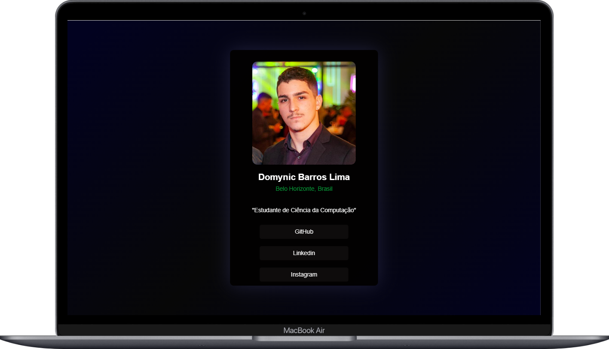
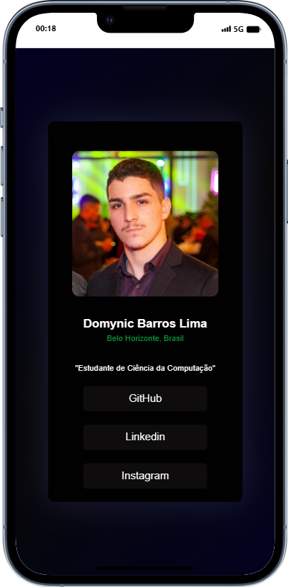

# Exercício - Aula 3 (Card Front-End)

## Resumo:

Essa atividade consiste em recriar um card "LinkTree" com HTML e CSS, seguindo o modeolo "img_referencia.jpg".

## Detalhes

- Autor: [Domynic Barros Lima](https://github.com/DomynicBl)
- Instituição: [Ioasys](https://ioasys.com.br/)
- Professor Responsável: Gustavo Manca

    
    

